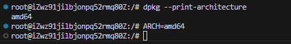
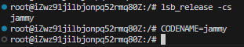
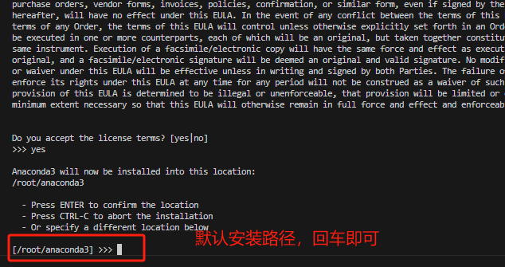

## 一、检查云主机系统
```bash
cat /etc/os-release
```


## 二、检查系统apt源

apt源配置文件位置/etc/apt/sources.list
说明：文件内容为空，使用apt命令默认使用官方源。


## 三、检查python的pip源
输入查询pip源代码指令
```bash
sudo pip config list
```
如果返回的内容为空，则代表没有设置源，使用pip命令默认使用官方源。

查看pip的路径。
```bash
pip show pip
```


比如你要修改警告。就直接输入
```bash
grep -rn "Running pip as the 'root'" /usr/local/lib/python3.10/

```

## 四、配置梯子
基于这个github项目配置的
https://github.com/nelvko/clash-for-linux-install

1. 克隆项目

```bash 
git clone --branch master --depth 1 https://gh-proxy.com/https://github.com/nelvko/clash-for-linux-install.git
```
2. 进入项目目录
```bash
cd clash-for-linux-install
```

3. 执行一键式脚本
```bash
sudo bash install.sh
```

4. 输入clash订阅链接即可
```bash
# 我的url：
https://qimeng.ffzjv.cn/api/v1/client/subscribe?token=ac518ececa6b139eca4ab2924e3aad96

# 个人使用推荐购买地址：
https://qimeng.ffzjv.cn/api/v1/client/subscribe?token=ac518ececa6b139eca4ab2924e3aad96

# 公司共同使用的话推荐购买地址：
https://paoluz.link/auth/register?code=Xund
```
5. 设置代理节点ui界面


6. 关闭自动启动clash
root目录下的.bashrc文件中加入了这行代码，一旦检测到终端开启，则执行这个shell脚本。

修改这个脚本中的clash on这条命令，注释掉即可，这样就不会开启终端后自启。


7. 常用指令
```bash
clash on # 开启普通代理
clash off # 关闭普通代理

clashtun on #开启tun代理模式
clshtun off #关闭tun代理模式
clashui #打开ui设置
```
8. 普通代理和tun代理的区别

| 项目                      | 普通代理模式（HTTP/SOCKS）         | Tun 模式（内核全局代理）             |
|---------------------------|-----------------------------------|-------------------------------------|
| 流量代理粒度              | 应用级（需设置）                  | 系统级（所有）                      |
| 支持协议                  | TCP（HTTP/HTTPS）                 | TCP + UDP + ICMP（如 ping）         |
| 是否支持 ping             | ❌ 不支持                         | ✅ 支持                             |
| 是否支持浏览器代理        | ✅ 支持                           | ✅ 支持                             |
| 是否支持 curl             | ✅ 支持（需设置 proxy）           | ✅ 支持                             |
| 是否需要设置 http_proxy    | 是                                | 否（系统已路由）                    |
| 实现方式                  | 应用层代理（用户空间）            | 内核网络接口（tun设备）             |

常用的一些代码
| 工具            | 普通代理是否支持                       | 是否需要单独配置 | Tun 模式是否需要额外配置 |
| ------------- | ------------------------------ | -------- | -------------- |
| `curl`        | ✅ 支持（环境变量）                     | 否        | 否              |
| `wget`        | ✅ 支持（环境变量）                     | 否        | 否              |
| `git`         | ✅ 支持（需 `git config`）           | ✅ 是      | 否              |
| `ping`        | ❌ 不支持                          | -        | ✅ 支持           |
| `apt` / `dnf` | ✅（需要设置 `Acquire::http::Proxy`） | ✅ 是      | 否              |
| 所有流量都自动代理     | ❌ 否                            | -        | ✅ 是            |


## 五、安装docker
1. 安装docker的前置四个包~

| 软件包名称             | 主要作用                                                   | 备注说明                                            |
| ----------------- | ------------------------------------------------------ | ----------------------------------------------- |
| `ca-certificates` | 提供 HTTPS 所需的根证书，用于验证远程服务器的 SSL/TLS 连接。                 | 比如访问 `https://download.docker.com` 时需要它来建立安全连接。 |
| `curl`            | 一个命令行工具，用于发送 HTTP 请求。                                  | 安装 Docker 时用于下载 GPG 密钥等内容。                      |
| `gnupg`           | GPG 工具，用于验证软件包签名的合法性。                                  | APT 使用它确保从软件源下载的软件没有被篡改。                        |
| `lsb-release`     | 提供 `lsb_release -cs` 命令，用于获取 Ubuntu 的发行版代号（如 `jammy`）。 | 在添加软件源时用来自动填写当前系统代号。                            |


```bash
sudo apt install -y ca-certificates curl gnupg lsb-release
```

2. 添加公钥，确保下载的内容安全（必须）
```bash
mkdir -p /etc/apt/keyrings # 如果有这个文件夹，此步骤略，一般都有
```
从docker官网下载GPG公要，并转换为Ubuntu可识别的格式，保存进keyrings目录下的docker.gpg文件中。
```bash
curl -fsSL https://download.docker.com/linux/ubuntu/gpg | sudo gpg --dearmor -o /etc/apt/keyrings/docker.gpg
```


3. 添加 Docker 软件源

3.1 获取系统架构，例如 amd64

Docker 为不同CPU架构（如 x86_64、ARM）准备了不同的二进制包。
```bash
ARCH=$(dpkg --print-architecture)
# 代码解释
# dpkg --print-architecture 获取当前CPU的架构并print打印出来
# 将打印出来的结果赋值给ARCH变量
```
↑这条命令等价于↓

3.2 获取 Ubuntu 发行版代号，例如 jammy
```bash
CODENAME=$(lsb_release -cs)
```
↑这条命令等价于↓


3.3 构建源地址字符串
拼接出一个完整的 APT 源地址，精确到当前系统架构和发行版用于最后下载。
```bash
DOCKER_REPO="deb [arch=$ARCH signed-by=/etc/apt/keyrings/docker.gpg] https://download.docker.com/linux/ubuntu $CODENAME stable"
```
↑代码解析↓


3.4 将源地址写入 APT 源列表文件
将构建好的源地址写入系统的 APT 源列表中。
```bash
echo "$DOCKER_REPO" | sudo tee /etc/apt/sources.list.d/docker.list > /dev/null
```
tee和/dev/null可写可不写


4. 安装 Docker
```bash
sudo apt update # 更新源
# 下载docker的五个包
sudo apt install -y docker-ce docker-ce-cli containerd.io docker-buildx-plugin docker-compose-plugin
```

| 软件包名称                   | 说明                                                                |
| ----------------------- | ----------------------------------------------------------------- |
| `docker-ce`             | Docker Community Edition 主程序（核心服务）                                |
| `docker-ce-cli`         | Docker 的命令行客户端工具（如 `docker run`、`docker build` 等）                 |
| `containerd.io`         | Docker 使用的容器运行时（runtime）组件                                        |
| `docker-buildx-plugin`  | 提供 `docker buildx` 支持，启用更高级构建功能（比如多平台构建）                          |
| `docker-compose-plugin` | 提供 `docker compose` 支持（注意是新版本 plugin 机制，不是旧的 `docker-compose` 命令） |


5. 验证docker

5.1 验证版本
```bash
docker --version
docker compose version
```


5.2 验证是否启动？
一般来说安装完docker后，docker会直接开启自启。
```bash
docker ps
```


5.3 是否让docker在服务器自启？
```bash
systemctl is-enabled docker # 检查docker是否是自启？
```


5.3.1手动设置docker每次服务器是否自启？
```bash
systemctl enable docker # 开机自动启动 Docker 服务
systemctl disable docker # 取消开机自启，但不停止当前正在运行的 Docker 服务
```

5.4 Docker被安装到哪了？
| 路径                                          | 内容                   | 说明                                 |
| ------------------------------------------- | -------------------- | ---------------------------------- |
| `/usr/bin/docker`                           | Docker 命令行客户端        | 你执行 `docker run`、`docker ps` 用的就是它 |
| `/usr/bin/containerd`                       | 容器运行时二进制             | Docker 用来实际运行容器的底层工具               |
| `/usr/bin/runc`                             | 更底层的容器运行器            | OCI 标准实现，containerd 调用它来执行容器       |
| `/usr/lib/systemd/system/docker.service`    | Systemd 服务文件         | 控制 Docker 开机自启和服务状态                |
| `/etc/docker/`                              | Docker 的配置文件目录       | 包含 `daemon.json`，可以设置镜像源等          |
| `/var/lib/docker/`                          | Docker 的默认数据目录       | 所有容器、镜像、卷、网络都存在这里                  |
| `/etc/systemd/system/docker.service.d/`     | 覆盖/扩展 Docker 启动配置的地方 | 比如你想添加镜像加速器参数                      |
| `/usr/libexec/docker/` 或 `/usr/lib/docker/` | 某些 plugin 的安装位置      | 如 buildx 或 compose 插件              |

- 常用命令验证文件位置
```bash
which docker             # 查看 docker 命令所在路径
whereis docker           # 查看 docker 相关文件
systemctl status docker  # 查看服务文件位置和状态
```


- Docker数据文件结构（默认在 /var/lib/docker/）

| 子目录           | 内容          |
| ------------- | ----------- |
| `containers/` | 所有容器的元数据和日志 |
| `image/`      | 下载的镜像       |
| `volumes/`    | 数据卷挂载       |
| `network/`    | 网络桥接信息      |
| `overlay2/`   | 容器的联合文件系统层  |


5.4 一些docker的小命令
```bash
systemctl start docker  # 手动启动docker
```


## 六、安装Conda
1. 下载conda完整版安装包
如果url不合适，也可以去官网看看，下载合适的版本
https://repo.anaconda.com/archive/
```bash
# 用curl下载
cd /tmp # 我想下载到数据盘，你想下载到哪都可以
curl -O https://repo.anaconda.com/archive/Anaconda3-2024.02-1-Linux-x86_64.sh
```
下载过程如↓（有梯子的好处）


2. 安装 Anaconda
```bash
bash Anaconda3-2024.02-1-Linux-x86_64.sh
```
进入一个图形化安装过程（命令行版本）
按小键盘↓或Enter滚动阅读许可协议，最后输入yes；
默认安装路径是 /root/anaconda3




root目录下的环境变量，conda并没有自动配置，所以我们需要自己把conda的环境变量写入进去。


写入后激活下下~
```bash
echo 'export PATH="/root/anaconda3/bin:$PATH"' >> ~/.bashrc
source ~/.bashrc
```


3. 验证
```bash
conda --version
```
好棒~你装上了


好棒！你全都成功了！

## N、一些小事情
比如要实时看CPU，内存等使用情况，用htop彩色观看
```bash
apt install htop
htop # 启动
```

关闭VScode的无脑索引，避免CPU爆炸

